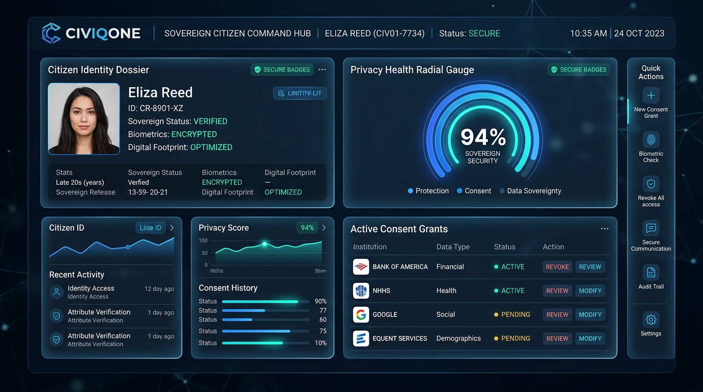
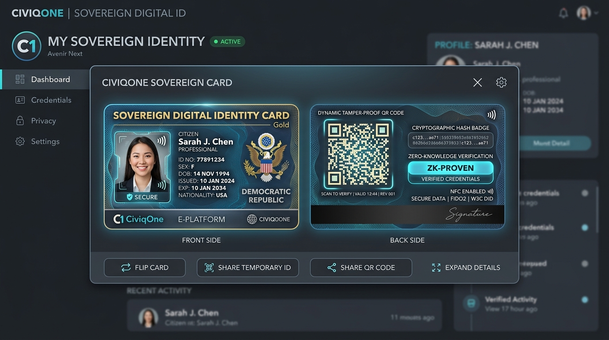
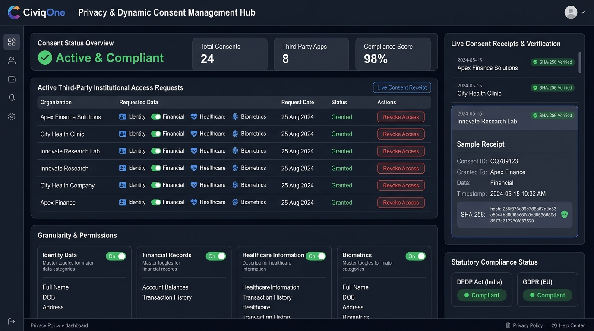
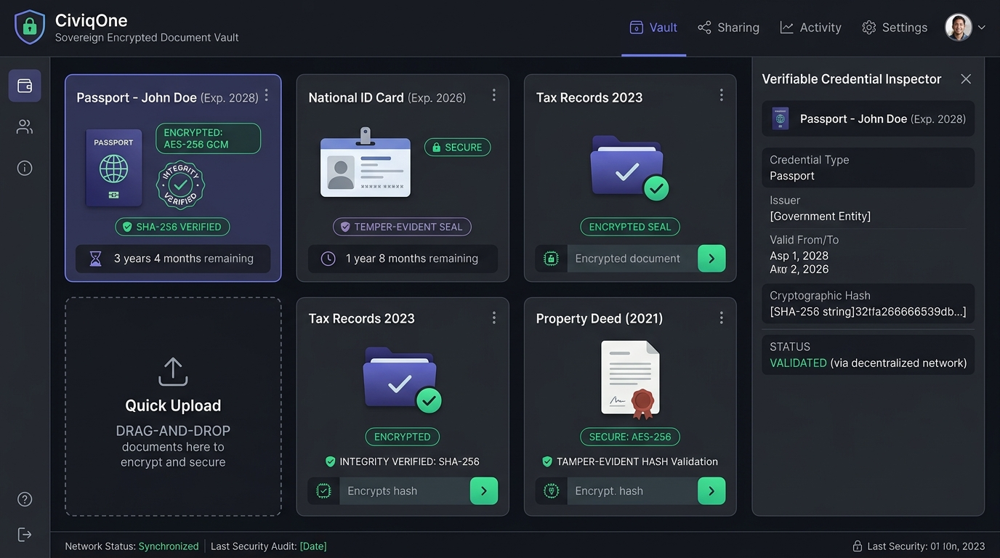
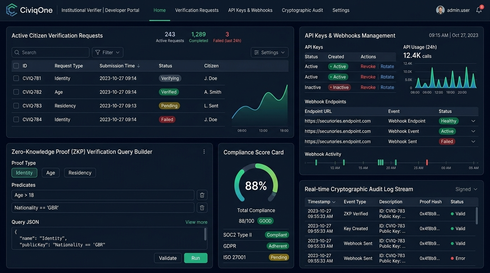
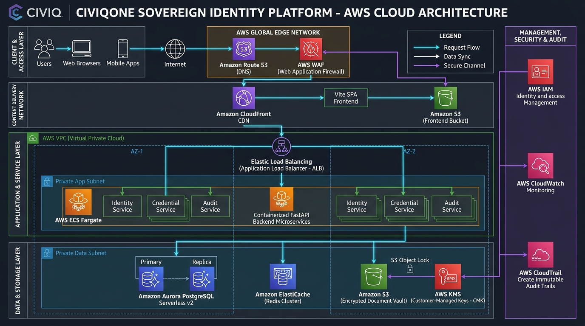
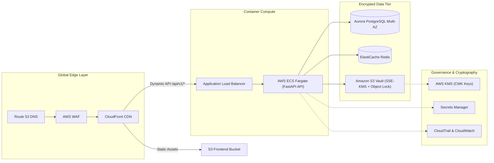

<div align="center">

# 🏛️ CiviqOne / SAMAGRA
### Sovereign Identity & Digital Civic Operating System

[](https://www.typescriptlang.org/)
[](https://react.dev/)
[](https://vitejs.dev/)
[](https://fastapi.tiangolo.com/)
[](https://tailwindcss.com/)
[](docs/AWS_ARCHITECTURE.md)
[](LICENSE)
[](SECURITY.md)

<p align="center">
  <b>A next-generation digital civic infrastructure empowering citizens with complete cryptographic sovereignty over personal data, verifiable credentials, and dynamic institutional consent lifecycles.</b>
</p>

[Key Features](#-key-features) • [Visual Previews](#-visual-previews) • [AWS Cloud Architecture](#-aws-enterprise-cloud-architecture) • [Folder Structure](#-folder-structure) • [Setup Instructions](#-quick-start--setup-instructions) • [Environment Reference](#-environment-variables) • [Contributing](#-contributing)

</div>

---

## 📖 Executive Summary

**CiviqOne** (also known as **SAMAGRA**) bridges citizens, trusted third-party institutions (banks, insurers, healthcare providers), and government agencies into a unified, privacy-first civic ecosystem. Built upon modern sovereign identity paradigms, CiviqOne eliminates centralized data honeypots through:

1. **Citizen Data Sovereignty**: Citizens possess and control their digital identities, biometric authorizations, and credentials on their terms.
2. **Dynamic Granular Consent**: Real-time permission granting and instantaneous one-click revocation for third-party institutional access.
3. **Zero-Knowledge Selective Disclosure**: Prove specific assertions (e.g., *Age > 18*, *State Resident*, *Income Qualified*) without leaking unneeded personally identifiable information (PII).
4. **Cryptographic Consent Receipts**: Every access grant produces an immutable, SHA-256 tamper-evident consent receipt aligned with statutory requirements (DPDP Act 2023 & GDPR).
5. **Encrypted Document Vault**: Client-side AES-256 GCM encrypted document storage with cryptographic integrity validation and automated expiry alerts.

---

## 📸 Visual Previews

<div align="center">

### 1. Sovereign Citizen Command Center
*Real-time citizen dashboard with sovereign identity status, privacy health radial score, active consent grants, and biometric quick actions.*


---

### 2. CiviqOne Digital Sovereign Card
*Dual-sided smart identity card featuring intricate guilloche security background, dynamic tamper-proof verification QR code, and zero-knowledge verification badges.*


---

### 3. Privacy & Dynamic Consent Management Hub
*Granular attribute permission toggles, instantaneous one-click revocation, and cryptographic SHA-256 verified consent receipts.*


---

### 4. Sovereign Encrypted Document Vault
*AES-256 GCM encrypted document repository with verifiable credential inspector and tamper-evident SHA-256 validation.*


---

### 5. Institutional Verifier & Developer Portal
*Enterprise verification console featuring Zero-Knowledge Proof query builders, API key/webhook studio, and live cryptographic audit logs.*


</div>

---

## ⚡ Key Features

| Domain | Capabilities |
| :--- | :--- |
| **Citizen Sovereign Portal** | WebAuthn / FIDO2 Passkey authentication, OTP fallback, biometric step-up modal, sovereign card flip & QR share, multi-language support (12+ Indian/global languages), multilingual voice assistant, and privacy health score. |
| **Consent & Permissions** | Real-time institutional access requests, attribute-level selective disclosure (Identity, Financial, Healthcare, Biometrics), one-click grant revocation, and downloadable cryptographic consent receipts. |
| **Encrypted Document Vault** | Client-side encrypted file uploads (Passport, National ID, Income Certificates), SHA-256 integrity inspection, expiring document radar, and delegated family vault access. |
| **Institutional Verifier** | Third-party institutional onboarding, ZKP query engine, developer API keys with secret rotation, webhook dispatching, and compliance scorecards. |
| **Government Case Portal** | Departmental official workflow, document verification queues, fraud anomaly detection, audit trail inspection, and official citizen dossier reviews. |
| **Platform Super Admin** | System operational telemetry, security incident tracking, database inspection, audit log verification, and global organization approvals. |

---

## ☁️ AWS Enterprise Cloud Architecture

CiviqOne is engineered for enterprise-grade scalability, zero-trust security, and high availability on Amazon Web Services (AWS).

<div align="center">
  
</div>

### Architecture Topology Overview



### Key Infrastructure Pillars

1. **Edge & Perimeter Security**: **Amazon CloudFront** + **Route 53** with **AWS WAF** inspecting traffic at the edge (OWASP Top 10, DDoS mitigation, and rate limiting).
2. **Containerized Serverless Compute**: **AWS ECS Fargate** runs containerized FastAPI microservices across private multi-AZ subnets behind an **Application Load Balancer (ALB)**.
3. **Multi-AZ Resilient Database**: **Amazon Aurora PostgreSQL Serverless v2** with automatic multi-AZ failover (< 30s) and read-replicas for high-throughput reporting.
4. **Tamper-Proof Document Vault**: **Amazon S3** with **SSE-KMS** Customer Managed Keys and **S3 Object Lock (Compliance Mode)** ensuring write-once-read-many (WORM) storage for official verification certificates.
5. **Real-Time Revocation Cache**: **Amazon ElastiCache Redis** maintains low-latency session locks and instant consent revocation lookup tables.
6. **Zero-Secret Secrets Management**: **AWS Secrets Manager** injects credentials at runtime without storing secrets in source control.

> 📖 **Deep Dive**: For full technical specifications, subnet CIDR tables, RPO/RTO metrics, and compliance mappings, see [docs/AWS_ARCHITECTURE.md](docs/AWS_ARCHITECTURE.md).

---

## 📂 Folder Structure

The repository adheres strictly to **Domain-Driven Feature Isolation (DDFI)**. Each business domain is self-contained with explicit public barrel exports.

```
project1/
├── .github/                      # GitHub configurations
│   ├── workflows/ci.yml          # Automated CI pipeline (lint, typecheck, build)
│   ├── CODEOWNERS                # Domain code ownership definitions
│   └── PULL_REQUEST_TEMPLATE.md  # Standardized PR checklist template
├── backend/                      # Sovereign Python Backend (FastAPI)
│   ├── alembic/                  # Database migration scripts
│   ├── app/                      # FastAPI application source
│   │   ├── api/v1/endpoints/     # REST routes (auth, citizen, documents, requests)
│   │   ├── core/                 # App configuration & security policies
│   │   ├── crud/                 # Database CRUD operations
│   │   ├── db/                   # Database session & seed data
│   │   ├── models/               # SQLAlchemy ORM models
│   │   └── schemas/              # Pydantic validation schemas
│   ├── tests/                    # Backend automated pytest suite
│   ├── .env.example              # Backend environment template
│   ├── requirements.txt          # Python dependencies
│   └── run_server.py             # Local development server runner
├── docs/                         # Architecture & Documentation
│   ├── architecture/             # AWS Cloud Architecture diagrams
│   ├── screenshots/              # High-resolution UI screenshots
│   └── AWS_ARCHITECTURE.md       # Comprehensive cloud infrastructure whitepaper
├── public/                       # Static public web assets & logos
├── src/                          # Frontend Application (React 19 + TypeScript)
│   ├── app/                      # Application root & providers
│   ├── components/               # Atomic Design UI Components
│   │   ├── chat/                 # Floating multilingual citizen AI assistant
│   │   ├── civiqone-card/        # Digital Sovereign Card with Guilloche & QR
│   │   ├── layout/               # Shells & headers (Citizen, Org, Gov, Admin)
│   │   ├── shared/               # Cross-domain shared modals & overlays
│   │   └── ui/                   # Reusable UI primitives (Buttons, Cards, Dialogs)
│   ├── constants/                # Routes & multi-language definitions
│   ├── features/                 # Domain-Driven Feature Modules (DDFI)
│   │   ├── actions/              # Action Center & pending approvals
│   │   ├── admin/                # Super Admin operational dashboard
│   │   ├── applications/         # Citizen civic service applications
│   │   ├── assistant/            # Multilingual AI citizen assistant
│   │   ├── auth/                 # WebAuthn, Passkeys & OTP onboarding
│   │   ├── benefits/             # Citizen welfare eligibility engine
│   │   ├── dashboard/            # Central sovereign command hub
│   │   ├── data/                 # Personal data dashboard & exports
│   │   ├── documents/            # Encrypted document vault & inspector
│   │   ├── family/               # Delegated family & dependent management
│   │   ├── government/           # Government official verification portal
│   │   ├── identity/             # Sovereign identity credentials dossier
│   │   ├── journey/              # Civic journey & life events tracker
│   │   ├── notifications/        # Real-time event notifications
│   │   ├── organization/         # Institutional verification & developer hub
│   │   ├── payments/             # Civic fee payments & receipts
│   │   ├── privacy/              # Privacy & dynamic consent center
│   │   ├── profile/              # Citizen sovereign profile settings
│   │   ├── security/             # Security center & biometric controls
│   │   ├── services/             # Citizen services catalog
│   │   └── support/              # Citizen customer care & grievance desk
│   ├── hooks/                    # Reusable React custom hooks
│   ├── lib/                      # Cryptography (AES-GCM, SHA-256) & utility helpers
│   ├── mocks/                    # Local-first mock storage & seed data
│   ├── schemas/                  # Zod validation schemas
│   ├── services/                 # Centralized data access & API clients
│   └── types/                    # System-wide TypeScript type contracts
├── .env.example                  # Frontend environment template
├── .gitignore                    # Hardened Git exclusions
├── CONTRIBUTING.md               # Contribution guidelines & branching workflow
├── LICENSE                       # MIT License
├── package.json                  # Node.js dependencies & scripts
├── README.md                     # Master project documentation
├── SECURITY.md                   # Security & responsible disclosure policy
├── tailwind.config.js            # Tailwind CSS design system configuration
└── vite.config.ts                # Vite build and bundling configuration
```

---

## 🚀 Quick Start & Setup Instructions

### Prerequisites
- **Node.js**: `v18.0.0` or higher (`v20+` recommended)
- **npm**: `v9.0.0` or higher
- **Python**: `v3.10` or higher *(Only required if running the local FastAPI backend)*

---

### Mode 1: Instant Zero-Dependency Frontend (30 Seconds)

CiviqOne includes an **advanced local-first mock engine** with cryptographically realistic seed data, allowing complete frontend evaluation without setting up Python or a database.

1. **Clone the repository:**
   ```bash
   git clone https://github.com/raghavendrac2006/project1.git
   cd project1
   ```

2. **Install frontend dependencies:**
   ```bash
   npm install
   ```

3. **Configure environment:**
   ```bash
   cp .env.example .env
   ```
   *(Note: The default `.env.example` sets `VITE_USE_MOCK=true`, enabling instant standalone functionality).*

4. **Launch the development server:**
   ```bash
   npm run dev
   ```

5. **Open in browser:**
   Navigate to [http://localhost:5173](http://localhost:5173).
   - Citizen Portal: Click **"Explore Demo"** or login with `citizen@civiqone.org` / `Password@123`
   - Institutional Verifier: Navigate to `/org/login`
   - Government Officer: Navigate to `/gov/login`
   - Super Admin: Navigate to `/admin/login`

---

### Mode 2: Full-Stack Development (Frontend + FastAPI + Database)

To run the complete full-stack environment with the FastAPI REST API:

#### 1. Setup & Start Backend Server

```bash
# Navigate to backend directory
cd backend

# Create and activate Python virtual environment
python -m venv venv

# Windows:
.\venv\Scripts\activate
# Linux/macOS:
# source venv/bin/activate

# Install dependencies
pip install -r requirements.txt

# Configure backend environment
cp .env.example .env

# Run database migrations and seed initial data
python -m alembic upgrade head

# Start FastAPI server with live reload
python run_server.py
```

Backend will be accessible at:
- **API Base:** [http://localhost:8000/api/v1](http://localhost:8000/api/v1)
- **Interactive Swagger Docs:** [http://localhost:8000/docs](http://localhost:8000/docs)
- **ReDoc:** [http://localhost:8000/redoc](http://localhost:8000/redoc)

#### 2. Connect Frontend to Backend

In the root directory, update `.env`:
```ini
VITE_API_BASE_URL=http://localhost:8000/api/v1
VITE_USE_MOCK=false
```

Start the frontend:
```bash
npm run dev
```

---

### Mode 3: Production Build & Verification

```bash
# Run type checking and production Vite bundle
npm run build

# Run Oxlint static analysis
npm run lint

# Preview the production build locally
npm run preview
```

---

## 🔐 Environment Variables

> 🛡️ **Zero Secrets Policy**: `.env` files are strictly excluded from Git via `.gitignore`. Never commit credentials. Always reference `.env.example`.

### Frontend Configuration (`.env.example`)

| Variable | Description | Default |
| :--- | :--- | :--- |
| `VITE_APP_TITLE` | Application page title | `CiviqOne — Digital Civic Operating System` |
| `VITE_API_BASE_URL` | Target FastAPI backend URL | `http://localhost:8000/api/v1` |
| `VITE_USE_MOCK` | Enable local-first mock engine | `true` |
| `VITE_API_TIMEOUT_MS` | HTTP network request timeout in ms | `10000` |
| `VITE_ENABLE_ANALYTICS`| Enable telemetry reporting | `false` |

### Backend Configuration (`backend/.env.example`)

| Variable | Description | Default / Example |
| :--- | :--- | :--- |
| `PROJECT_NAME` | Name of the backend service | `CIVICONE / SAMAGRA Sovereign Backend` |
| `API_V1_STR` | API prefix string | `/api/v1` |
| `SECRET_KEY` | Cryptographic secret for JWT signing | `change_this_to_a_secure_key_in_production` |
| `ACCESS_TOKEN_EXPIRE_MINUTES` | Token session validity | `10080` (7 days) |
| `DATABASE_URL` | SQLAlchemy connection string | `sqlite:///./civicone_local.db` (or PostgreSQL) |
| `BACKEND_CORS_ORIGINS` | Allowed CORS origins JSON array | `["http://localhost:5173", ...]` |

---

## 🔒 Security & Privacy Guarantees

- **Zero Data Harvesting**: The platform never sells, aggregates, or brokers personal data.
- **Client-Side Envelope Encryption**: Sensitive documents are encrypted using AES-GCM before transmission.
- **Cryptographic Nonce & Verification**: Consent grants and verification receipts contain cryptographic nonces and digital signatures to prevent replay attacks.
- **Statutory Compliance**: Native adherence to the **India Digital Personal Data Protection Act (DPDP 2023)** and **GDPR**.
- **Responsible Disclosure**: See [SECURITY.md](SECURITY.md) for our vulnerability reporting policy.

---

## 🤝 Contributing & Engineering Standards

We welcome contributions! Please review:
1. [CONTRIBUTING.md](CONTRIBUTING.md) for detailed Git Flow, branch conventions, and testing standards.
2. [.github/CODEOWNERS](.github/CODEOWNERS) for domain module ownership.

### Commit Convention
We follow [Conventional Commits](https://www.conventionalcommits.org/):
```bash
feat(vault): add SHA-256 integrity inspection
fix(auth): correct WebAuthn passkey registration flow
docs(architecture): update AWS cloud infrastructure diagram
```

---

## 📜 License

This project is licensed under the **MIT License** — see the [LICENSE](LICENSE) file for details.

---

<div align="center">
  <b>CiviqOne / SAMAGRA — Restoring Sovereignty to the Citizen.</b><br>
  Built with ❤️ by Sovereign Civic Contributors.
</div>
