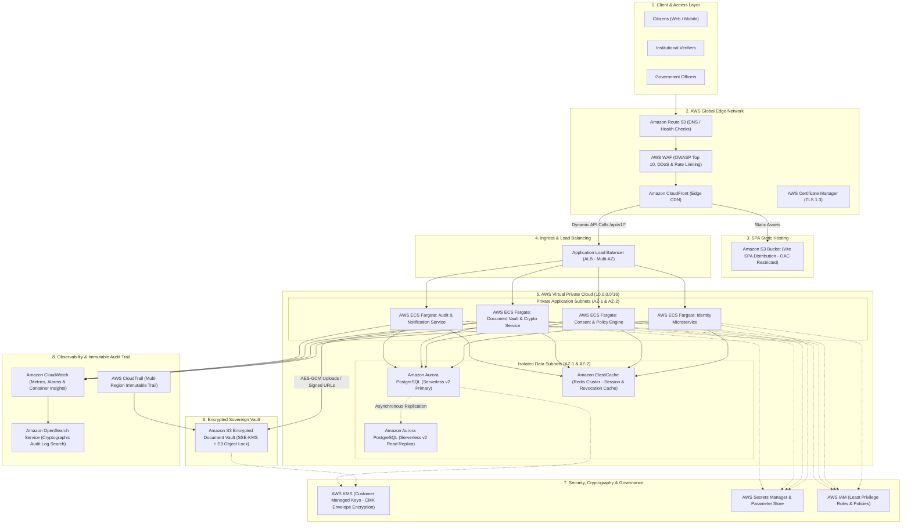

# CiviqOne / SAMAGRA — AWS Enterprise Cloud Architecture

## Executive Overview

**CiviqOne** is a mission-critical **Digital Civic Operating System & Sovereign Identity Platform**. Designed to handle sensitive citizen dossiers, cryptographic identity verification, granular data consent receipts, and encrypted document storage, its cloud infrastructure requires uncompromising security, high availability, sub-second latency, and strict zero-trust governance.

This document outlines the production-ready **Amazon Web Services (AWS)** enterprise cloud architecture designed to support millions of concurrent citizens, relying institutions, and government authorities while complying with global data protection mandates including the **Digital Personal Data Protection Act (DPDP 2023)** and **GDPR**.

---

## 1. High-Level Architecture Topology

### Architectural Flow (Mermaid Specification)

---

## 2. Layer-by-Layer Architectural Specification

### 2.1 Edge & Perimeter Security Layer
- **Amazon Route 53**: Provides low-latency DNS resolution, geo-proximity routing, and automatic DNS failover with health checks.
- **AWS WAF (Web Application Firewall)**: Inspects inbound traffic at the edge before reaching compute resources:
  - Managed Rules for OWASP Top 10 vulnerabilities (SQLi, XSS, CSRF, Path Traversal).
  - Rate-limiting rules (throttling requests exceeding 2,000 requests/5 minutes per IP).
  - Geographic blocking and bad bot protection.
- **Amazon CloudFront**: Serves the single-page application (SPA) globally with sub-50ms edge caching. Terminated with TLS 1.3 via **AWS Certificate Manager (ACM)**.
- **Origin Access Control (OAC)**: Enforces that the frontend S3 bucket can *only* be accessed via CloudFront, eliminating direct public bucket exposure.

### 2.2 Ingress & Compute Layer
- **Application Load Balancer (ALB)**:
  - Deployed across multiple Availability Zones (AZ-1, AZ-2).
  - TLS termination at the ALB using elliptic curve cryptography certificates.
  - Health check endpoints (`/api/v1/health` and `/`) routed to active container targets.
- **AWS ECS Fargate (Serverless Containers)**:
  - Runs the containerized **FastAPI** Python application microservices.
  - Zero server management overhead with automated OS patching.
  - Auto-scaling policies configured on CPU (>70%) and memory (>80%) utilization.
  - Located inside private VPC subnets with egress routed strictly through NAT Gateways.

### 2.3 Data & Relational Persistence Layer
- **Amazon Aurora PostgreSQL Serverless v2**:
  - Multi-AZ cluster with automatic failover (typical failover time < 30 seconds).
  - Instant vertical autoscaling between 0.5 and 16 ACUs (Aurora Capacity Units) based on traffic spikes.
  - Read replicas configured in secondary AZ to offload analytics, reporting, and search workloads.
  - Automated continuous backups retained for 35 days with Point-In-Time Recovery (PITR) to any second.
  - Storage encrypted at rest using AWS KMS (AES-256).

### 2.4 Encrypted Sovereign Document Vault
- **Amazon S3 Document Vault**:
  - Stores citizen credentials, encrypted biometric vectors, and identity documentation.
  - **Server-Side Encryption with Customer-Managed Keys (SSE-KMS)**: Enforces envelope encryption where every stored file is encrypted with a unique data key.
  - **S3 Object Lock (Compliance Mode)**: Ensures tamper-evident, write-once-read-many (WORM) storage for official verification certificates and consent receipts.
  - **Pre-Signed URLs**: Direct client-to-S3 secure uploads/downloads using short-lived (5-minute expiration) cryptographically signed URLs.
  - **Public Access Blocked**: Strict account-level and bucket-level S3 Block Public Access enabled.

### 2.5 In-Memory Cache & Revocation Engine
- **Amazon ElastiCache for Redis**:
  - Redis cluster in Multi-AZ configuration with automatic failover.
  - Used for real-time revocation blacklists (instantaneous consent withdrawal).
  - Rate limiting token buckets and temporary session lock states.
  - Data encrypted in transit (TLS) and at rest (KMS).

### 2.6 Cryptographic Security & Zero-Trust Governance
- **AWS Key Management Service (KMS)**:
  - Dedicated Customer Managed Keys (CMKs) with annual key rotation enabled.
  - Separate keys for Database Volume Encryption, S3 Document Vault, and Application-Level Envelope Encryption.
  - Multi-Region key replication ready for disaster recovery scenarios.
- **AWS Secrets Manager**:
  - Eliminates hardcoded credentials and passwords from application code.
  - Automatic rotation of database credentials and JWT signing secret seeds.
- **AWS IAM (Identity & Access Management)**:
  - Least-privilege IAM roles for ECS Task Execution and Task Roles.
  - Tasks can only access specific KMS keys and secret parameters required for their designated microservice domain.

### 2.7 Observability, Immutable Audit Trails & Compliance
- **AWS CloudTrail**:
  - Multi-region trail recording all management and data events across the AWS account.
  - Log files written to a dedicated, write-protected S3 audit bucket with SHA-256 log file integrity validation.
- **Amazon CloudWatch**:
  - Unified logging for ECS Fargate containers (Container Insights) and ALB access logs.
  - Automated CloudWatch Alarms dispatching to PagerDuty/SNS on elevated 5xx error rates, database connection limits, or unauthorized access attempts.
- **Amazon OpenSearch Service**:
  - Ingests structured audit log events for near-instant full-text search across millions of consent receipts, verification requests, and administrative operations.

---

## 3. Network Architecture & Subnet Topology

The platform deploys within a dedicated **Virtual Private Cloud (VPC)** with a `10.0.0.0/16` CIDR block structured across 3 tiers:

| Subnet Tier | CIDR Block (AZ-1) | CIDR Block (AZ-2) | Route Table / Internet Gateway Access |
| :--- | :--- | :--- | :--- |
| **Public Subnet** | `10.0.1.0/24` | `10.0.2.0/24` | Attached to Internet Gateway (ALB & NAT Gateways only) |
| **Private App Subnet** | `10.0.10.0/24` | `10.0.20.0/24` | Egress via NAT Gateway (ECS Fargate Tasks) |
| **Isolated Data Subnet** | `10.0.100.0/24` | `10.0.200.0/24` | No Internet routing (Aurora DB, ElastiCache, S3 VPC Endpoints) |

### VPC Endpoints (AWS PrivateLink)
To prevent traffic from traversing the public internet, VPC Endpoints are provisioned for:
- `com.amazonaws.<region>.s3` (Gateway Endpoint)
- `com.amazonaws.<region>.kms` (Interface Endpoint)
- `com.amazonaws.<region>.secretsmanager` (Interface Endpoint)
- `com.amazonaws.<region>.logs` (CloudWatch Interface Endpoint)

---

## 4. Disaster Recovery & High Availability (SLA)

| Metric | Target | Implementation Strategy |
| :--- | :--- | :--- |
| **High Availability (HA)** | **99.99% Uptime** | Multi-AZ deployment across all compute and database layers |
| **Recovery Point Objective (RPO)** | **< 1 minute** | Continuous Aurora WAL replication + S3 cross-region replication |
| **Recovery Time Objective (RTO)** | **< 15 minutes** | Automated ECS task relaunch + Aurora automated failover (< 30s) |

---

## 5. Regulatory Compliance Mapping

| Regulatory Standard | Platform Requirement | AWS Implementation Mapping |
| :--- | :--- | :--- |
| **DPDP Act (India 2023) § 6** | Notice & granular citizen consent | CiviqOne Consent Receipts + S3 Object Lock immutable audit trail |
| **DPDP Act (India 2023) § 8** | Strict data security safeguards | AWS KMS envelope encryption + VPC PrivateLink isolation |
| **GDPR Art. 17** | Right to erasure (Right to be Forgotten) | Granular consent revocation API + Redis active grant expiration |
| **GDPR Art. 32** | Security of processing | AES-256 encryption at rest + TLS 1.3 in transit + WAF rate limits |
| **ISO/IEC 27001** | Access control & cryptographic management | AWS IAM role isolation + AWS KMS Customer-Managed Key rotation |

---

## 6. Production Infrastructure as Code (IaC)

Infrastructure provisioning is automated via **Terraform** and **AWS CDK**:
- Automated state locking via Amazon S3 and DynamoDB table.
- Ephemeral staging environments deployed on branch previews.
- Production deployments gated by multi-party approval and automated security vulnerability scans.
